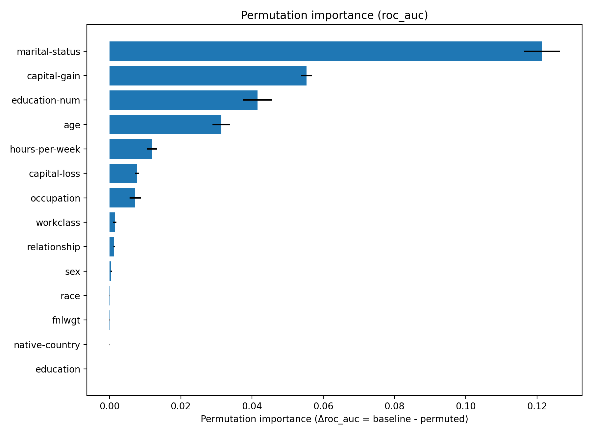

## mlops-sklearn-portfolio

scikit-learn + Pipeline で表形式MLを**学習→成果物→推論API→コンテナ**まで最短導線で通すポートフォリオ。

[](../../actions)
[](../../actions)
[](../../actions)

## ルール

* README は**300行未満**、図鑑は docs。
* 詳細なコマンド羅列は `docs/training.md` と `docs/ops.md` に置く。
* 実行結果スクショや長表は S3 の成果物か `docs/` にリンクだけ。
* 変更履歴は **CHANGELOG** 系統に一元化。README の「変更履歴」セクションは禁止。

### Quick Start
```bash
make init EXTRAS=[dev]          # 依存
make train-full DS=adult        # 学習
make check                      # 成果物/ログ 確認
make docker-build && make docker-run   # API (Docker)
curl -s localhost:8000/health
```

### Docs

* アーキテクチャと課題設定: [docs/overview.md](docs/overview.md)
* 学習/実行/長時間運用: [docs/training.md](docs/training.md)
* API（/health, /schema, /predict, /predict\_batch, /reload）: [docs/api.md](docs/api.md)
* Docker: [docs/docker.md](docs/docker.md)
* CI: [docs/ci.md](docs/ci.md)
* 運用・S3同期・ログ: [docs/ops.md](docs/ops.md)
* 激甚時撤収: [severe\_disaster\_manual.md](docs/severe_disaster_manual.md)
* 変更履歴: [CHANGELOG.md](docs/CHANGELOG.md)

### ディレクトリ

```
api/  src/  models/  artifacts/  logs/  tests/  docs/
```

- 「workers=1/2 の差」ひとこと比較（RPSの伸びと P95 の変化だけ）
- /reload の切替所要時間（ms）
- S3 latest/ とスナップショットの両立運用方針（既に書いてるならリンクだけ）

### 完成定義

- [ ] **ALB 経由 /healthz が常時 200**（ターゲットグループ Healthy） 

- [ ] **手動デプロイが再現可能**（新 TaskDef 登録 → force-new-deployment → 直前リビジョンへロールバックできる） 

- [ ] **観測の入口**として CloudWatch Logs に構造化ログが出ている（JSON1行） 

- [x] **IaC“薄切り”**（VPC/ALB/TG/ECS/ECR の最小一式を Terraform で再現可能。Import 完全一致は捨てる） 

- [ ] **evidenceフォルダ配下**：curl結果、ALB/TGヘルスSS、ECSイベント抜粋、terraform plan 抜粋 

- [ ] 「手動デプロイ再現可能」に**失敗からのロールバック実演**を明記。

- [ ] **観測はアラームを最低1個具体化**（例: 5xx率、TargetResponseTime、タスク異常終了）。 

- [ ] **CLI履歴の証跡化**: scriptコマンドかbash -xログ、加えてCloudTrail + Configを記事に添える

### 証跡チェックリスト

- [ ] ALB/TG: ヘルス一覧SS、curl -I https://{alb}/healthz、ターゲット登録変遷のイベント抜粋 : **_healthz_200_final.txt（curl -i）**

    - [ ] スクショ（TG Healthy, ALB Listeners）→ *_tg_healthy.png, *_alb_listener.png

- [ ] ECS: 新旧TaskDef ARN、force-new-deployment 実行ログ、ロールバックの実演記録

    - [ ] *_ecs_force_new_success.txt / *_ecs_events_rollback_demo.txt

    - [ ] *_prev_taskdef.txt / *_ecs_rollback_to_prev.txt

- [ ] CloudWatch Logs: 1行JSON例、@timestamp、level, requestId, path, latency_ms, status

    - [ ] *_cwlogs_json_line.txt（1行JSON例）

- [ ] CloudWatch Metrics/Alarm: 3件以上、しきい値と期間、誤検知のメモ

    - [ ] *_cw_alarm_put_5xx.txt / *_cw_alarm_describe_5xx.txt

- [ ] IaC: terraform plan 抜粋、State分離の方針メモ、命名規約1ページ

    - [ ] 既存の *_tf_plan_*, *_tf_apply_*, *_alb_dns.txt, *_tf_init_*.txt

- [ ] 負荷試験: k6スクリプト、summary.json、p90/RPS/エラー率、ALBアクセスログ抜粋

- [ ] 監査系: CloudTrailとConfigのクエリ内容とエビデンスのパス

    - [ ] *_cloudtrail_lookup_updateservice.txt（Configは後で追記でも可）

### 閾値最適化（PR曲線×F1最大）(2025-09-09)

- `make threshold DS=adult` で holdout 上の PR 曲線から F1 最大となる閾値を算出。
- 出力: `artifacts/threshold_<dataset>.json` と `artifacts/threshold.json`（共通名）。
- 将来: API 側で `?mode=binary` 時にこの閾値を使用する切替を追加予定。

### Permutation Importance（列単位・PNG出力）(2025-09-09)
- 生成: `make perm DS=adult REPEATS=8 MAXS=4000`
- 出力: `artifacts/perm_importance_openml_adult.png`（図）と `.csv` / `.json`
- 参考: 今回のベースライン AUC ≈ 0.91（holdout, scorer=roc_auc）



- コマンド結果は`docs/result.md`を参照